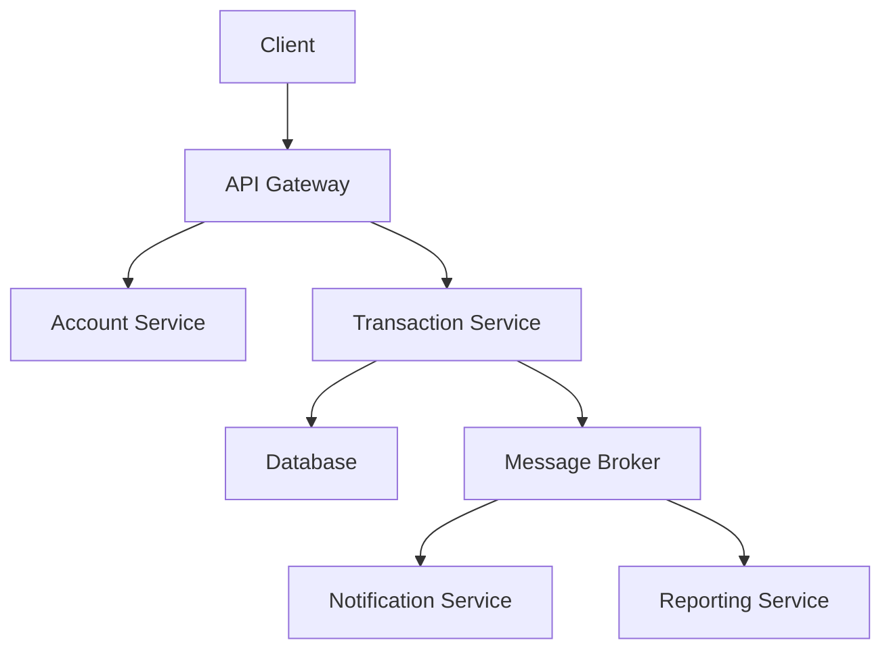

# 10-Day Software Engineering Skills Improvement Plan

## Days 1-10 Overview

### Day 1: Database Fundamentals & PostgreSQL Setup
**Theory (40 min):**  
- Overview of PostgreSQL architecture: storage engine, transaction management, and concurrency control  
- Understanding transaction isolation levels and ACID properties  

**Practical (30 min):**  
- Set up PostgreSQL in Docker with persistent volumes  
- Run basic SQL commands and verify connectivity  

**Resources:**  
- [PostgreSQL documentation (chapters 1–3)](https://www.postgresql.org/docs/)  
- [Docker volumes documentation](https://docs.docker.com/storage/volumes/)  

---

## Database Fundamentals (Focusing on Distributed System Consistency)

### 1. PostgreSQL Architecture Overview

#### 1.1 Storage Engine
- **Relations**: Data stored in 8KB pages  
- **MVCC**: Updates create new row versions  
- **WAL**: Crash recovery mechanism  
- **Buffer Cache**: Memory caching for frequent access

#### 1.2 Transaction Management
```sql
BEGIN;
UPDATE accounts SET balance = balance - 100.00 WHERE name = 'Alice';
UPDATE accounts SET balance = balance + 100.00 WHERE name = 'Bob';
COMMIT;
```

#### 1.3 Concurrency Control
- MVCC implementation
- Snapshot isolation
- Row-level locking
- Vacuum process

### 2. ACID Properties Deep Dive

| Property       | Description                                                                 |
|----------------|-----------------------------------------------------------------------------|
| **Atomicity**  | All-or-nothing transaction execution                                       |
| **Consistency**| Valid state transitions through constraints                                |
| **Isolation**  | Concurrent transactions don't interfere                                    |
| **Durability** | Committed changes survive system failures                                  |

### 3. Transaction Isolation Levels
```go
// Example retry logic in Go
func executeTransaction(db *sql.DB, txFunc func(*sql.Tx) error) error {
    maxRetries := 3
    for retries := 0; retries < maxRetries; retries++ {
        // Transaction logic with exponential backoff
    }
}
```

### 4. Distributed Consistency Patterns

#### 4.1 Saga Pattern
```go
type SagaCoordinator struct {
    steps []SagaStep
    // ... other fields
}

func (s *SagaCoordinator) Execute(ctx context.Context) error {
    // Saga execution logic
}
```

#### 4.2 Event Sourcing
```go
type EventStore interface {
    AppendEvents(ctx context.Context, streamID string, expectedVersion int64, events []Event) error
    ReadEvents(ctx context.Context, streamID string, fromVersion int64, maxCount int) ([]Event, error)
}
```

#### 4.3 CQRS Pattern
```go
// Command Handler
type OrderCommandHandler struct {
    eventStore EventStore
    // ... other dependencies
}

// Query Handler
type OrderQueryHandler struct {
    db *sql.DB
    // ... other dependencies
}
```

### 5. Real-world Implementations

#### Financial Transaction Service
```go
func (s *TransactionService) TransferFunds(ctx context.Context, fromAccount, toAccount string, amount decimal.Decimal) (string, error) {
    // Distributed lock acquisition
    // Transaction processing logic
    // Event publishing
}
```

#### Notification Service with Retry Logic
```go
func (s *NotificationService) HandleTransferCompleted(ctx context.Context, event *TransferCompletedEvent) error {
    // Async notification handling
    // Retry queue integration
}
```

## Best Practices

### Database Design
- Normalize data where appropriate
- Use proper indexing strategies
- Implement connection pooling

### Distributed Systems
- Implement circuit breakers
- Use health checks
- Monitor replication lag
- Implement automated recovery mechanisms



## Resources
- [Designing Data-Intensive Applications](https://dataintensive.net/)
- [PostgreSQL Official Documentation](https://www.postgresql.org/docs/)
- [Distributed Systems Patterns](https://martinfowler.com/articles/patterns-of-distributed-systems/)
